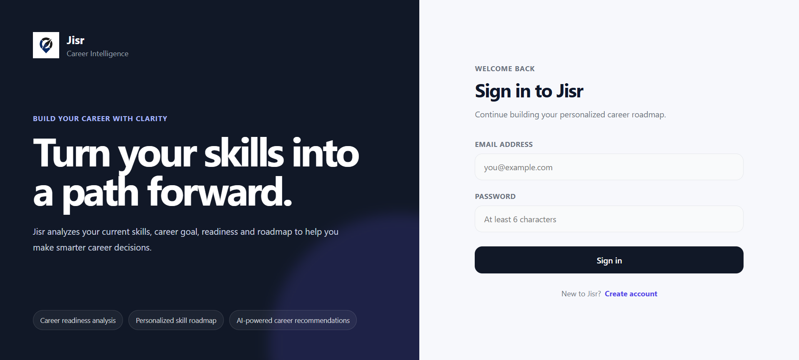
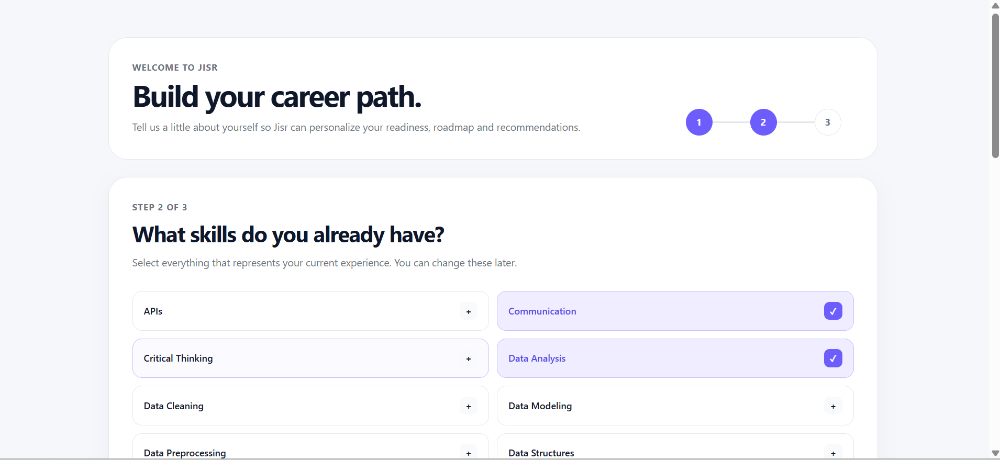
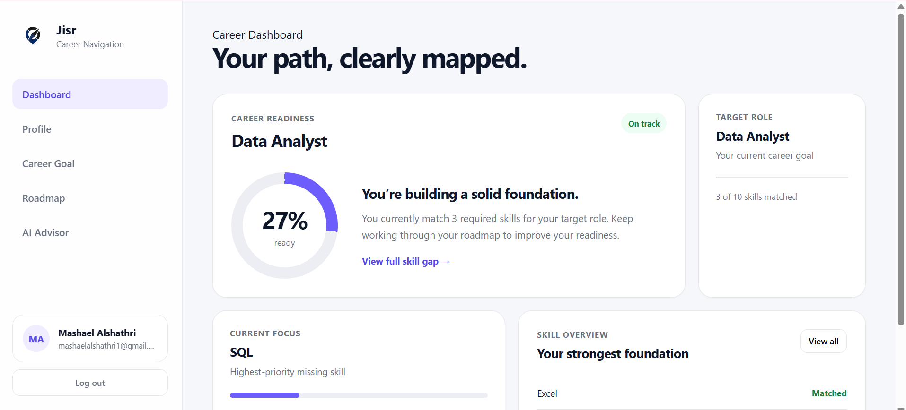
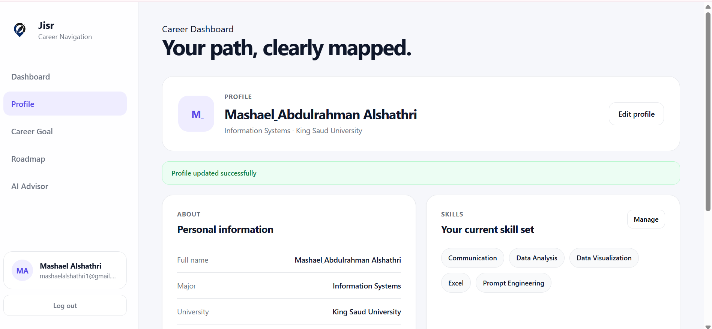
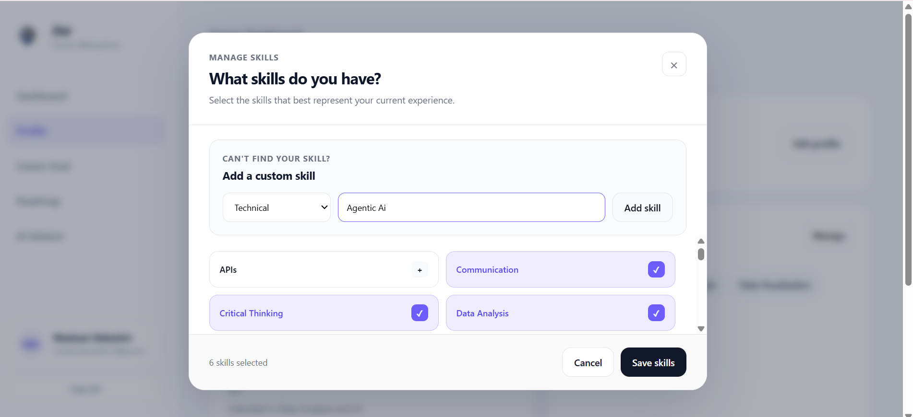
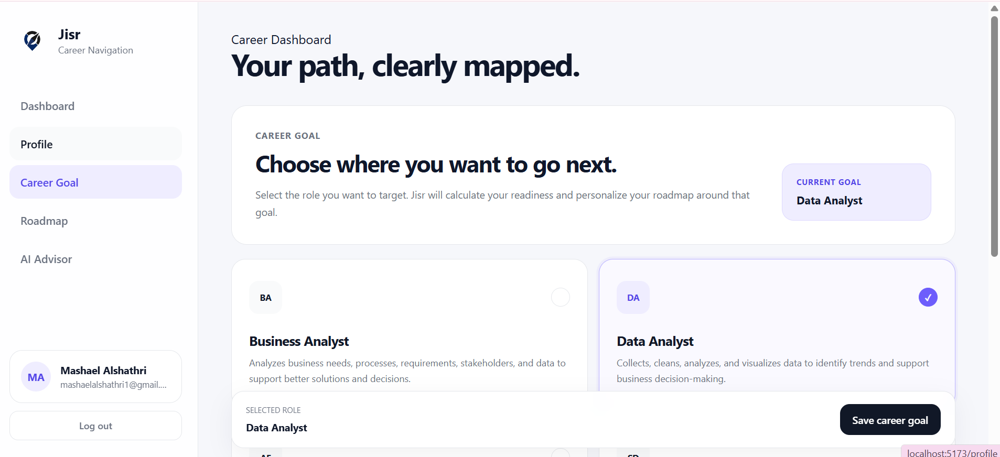
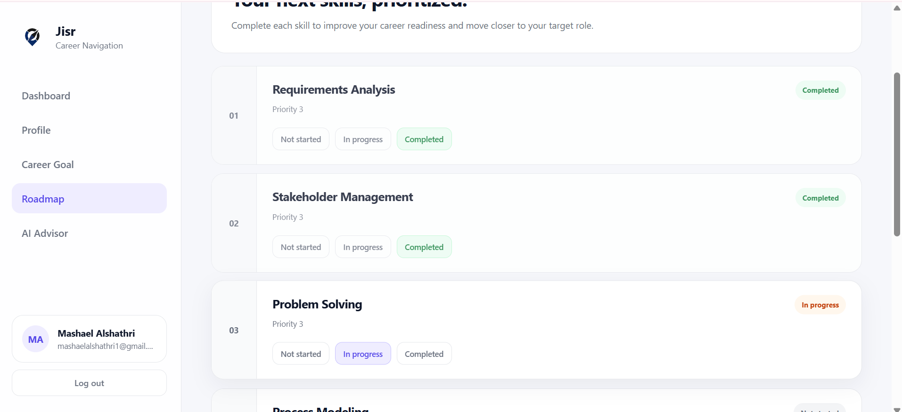
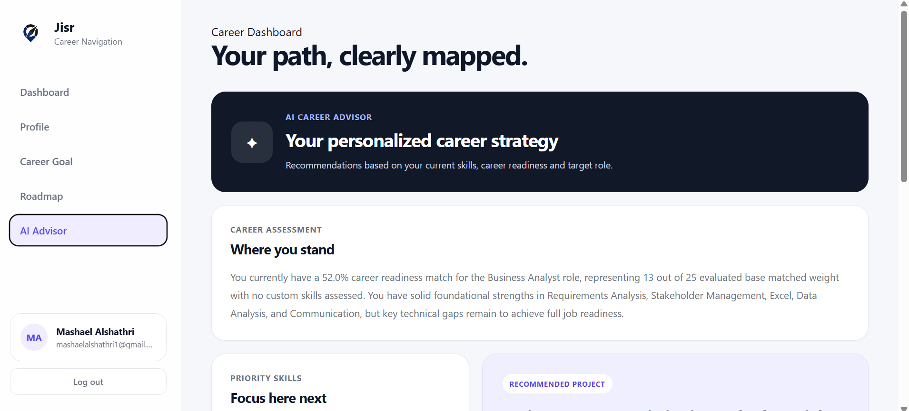

# Jisr — Career Intelligence Platform

Jisr is an AI-powered career intelligence platform designed to help university students understand their career readiness, identify skill gaps, and build a clearer path toward their target role.

Instead of providing generic career recommendations, Jisr analyzes the user's current skills against the requirements of a selected career and dynamically generates personalized insights, a skill roadmap, and AI-powered career recommendations.

## ✨ Key Features

### Career Readiness Analysis
Jisr calculates a weighted readiness score by comparing the user's current skills with the skills required for their target career.

The dashboard provides:
- Career readiness percentage
- Matched skills
- Missing skills
- Highest-priority skill gaps

### Personalized Skill Roadmap
Based on the user's missing skills, Jisr automatically generates a personalized roadmap.

Users can track each skill through:

`Not Started → In Progress → Completed`

When a roadmap skill is completed, it is automatically added to the user's profile and the readiness score is updated.

### Dynamic Career Goals
Users can change their target career at any time.

Jisr automatically:
- Recalculates career readiness
- Identifies a new skill gap
- Removes the previous roadmap
- Generates a new roadmap for the selected career

### AI Skill Weighting
Users are not limited to predefined skills.

They can add custom skills under:
- Technical
- Business
- Soft Skills

Google Gemini evaluates the relevance of custom skills to the user's target career and assigns a weight that contributes to the career readiness analysis.

### AI Career Advisor
Jisr uses Google Gemini to generate personalized career guidance based on the user's:

- Target career
- Current skills
- Missing skills
- Career readiness
- Custom skills
- Roadmap progress

The AI Advisor provides:
- Career assessment
- Priority skills
- Recommended portfolio project
- Actionable next steps

### User Profiles & Authentication
Jisr includes a complete user flow with:

- Account creation and sign in
- First-time onboarding
- Personal profile management
- Skill management
- Certificates and projects
- Persistent user data

Returning users can sign in and continue from their existing career profile without repeating onboarding.

---

## 🧠 How Jisr Works

```text
Create Account
      ↓
Onboarding
      ↓
Build Career Profile
      ↓
Select Target Career
      ↓
Analyze Current Skills
      ↓
Calculate Career Readiness
      ↓
Identify Skill Gaps
      ↓
Generate Personalized Roadmap
      ↓
AI Career Advisor
      ↓
Track Progress & Improve Readiness
```

---

## 🛠️ Tech Stack

### Frontend
- React
- Vite
- JavaScript
- CSS

### Backend
- Python
- FastAPI
- Pydantic

### Database & Authentication
- Supabase
- PostgreSQL
- Supabase Auth

### Artificial Intelligence
- Google Gemini API
- Structured AI responses
- AI-based skill relevance weighting
- Personalized career recommendations

### Development Tools
- Git
- GitHub
- VS Code
- Swagger / OpenAPI

---

## 🏗️ Project Architecture

```text
Jisr
│
├── unipath-backend/
│   ├── main.py
│   ├── models.py
│   ├── database.py
│   ├── services.py
│   ├── requirements.txt
│   └── .env.example
│
├── unipath-frontend/
│   ├── src/
│   │   ├── components/
│   │   ├── layouts/
│   │   ├── pages/
│   │   ├── assets/
│   │   └── lib/
│   ├── package.json
│   └── .env.example
│
├── .gitignore
└── README.md
```

---

## 🔐 Environment Variables

Environment variables are excluded from version control.

Create a `.env` file inside `unipath-backend`:

```env
SUPABASE_URL=
SUPABASE_KEY=
SUPABASE_SERVICE_KEY=
GEMINI_API_KEY=
```

Create another `.env` file inside `unipath-frontend`:

```env
VITE_SUPABASE_URL=
VITE_SUPABASE_ANON_KEY=
```

Never expose private API keys or service-role keys in the frontend.

---

## 🚀 Running the Project

### 1. Clone the repository

```bash
git clone https://github.com/mashael1122/Jisr.git
cd Jisr
```

### 2. Backend

```bash
cd unipath-backend
pip install -r requirements.txt
uvicorn main:app --reload
```

The FastAPI backend will run locally on port `8000`.

### 3. Frontend

Open another terminal:

```bash
cd unipath-frontend
npm install
npm run dev
```

The React application will run using the local Vite development server.

---
## 📸 Interface

### Sign In
Secure authentication for new and returning users.



### Onboarding
New users build their initial career profile and select their target career through a guided onboarding experience.



### Career Dashboard
The dashboard provides an overview of career readiness, matched skills, skill gaps, and the user's current focus.



### Profile & Skills
Users can manage their profile, skills, certificates, projects, and custom skills.





### Career Goal
Users can select or change their target career, dynamically updating their career analysis and roadmap.



### Personalized Roadmap
The roadmap transforms identified skill gaps into a clear, trackable progression path.



### AI Career Advisor
The AI Advisor provides personalized career insights, priority skills, project recommendations, and actionable next steps.



---

## 🎯 Project Motivation

As a university student, choosing a career path is not always the difficult part — understanding what is actually required to reach that career can be.

I built Jisr to explore how AI and data-driven systems can turn career goals into actionable progress. The project combines career readiness analysis, dynamic skill-gap detection, personalized roadmaps, and generative AI recommendations into one application.

Jisr was also an opportunity to apply concepts from information systems, full-stack development, database design, API integration, and artificial intelligence in a practical project.

---

## 🔮 Future Improvements

Potential future improvements include:

- AI-generated learning resource recommendations
- CV analysis and skill extraction
- More career paths and skill datasets
- Advanced proficiency-based readiness scoring
- Progress analytics over time
- Deployment for public access

---

## 👩‍💻 Author

**Mashael Alshathri**

Information Systems Student  
King Saud University

Built as a personal portfolio project to explore the intersection of information systems, career development, and artificial intelligence.